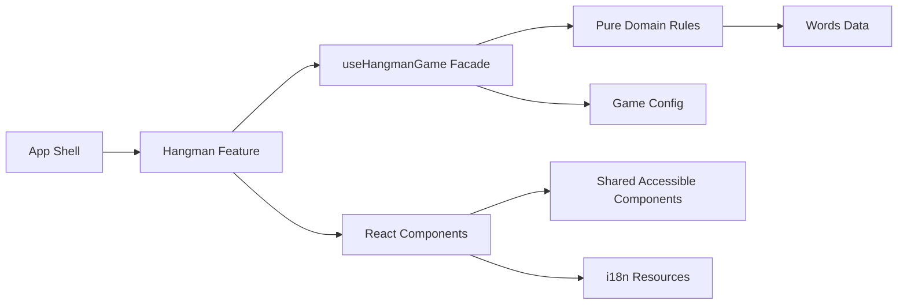

# Architecture Diagram

```mermaid
flowchart LR
  App[App Shell] --> Feature[Hangman Feature]
  Feature --> Components[React Components]
  Feature --> Hook[useHangmanGame Facade]
  Hook --> Domain[Pure Domain Rules]
  Hook --> Config[Game Config]
  Components --> Shared[Shared Accessible Components]
  Components --> I18n[i18n Resources]
  Domain --> Data[Words Data]
```
