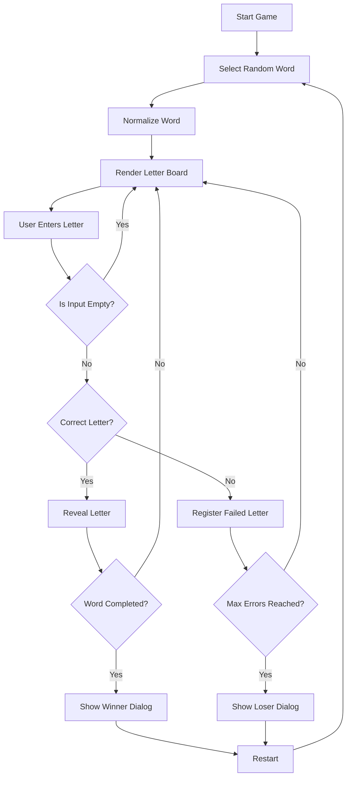

# Game Flow

```mermaid
flowchart TD
  A[Start Game] --> B[Select Random Word]
  B --> C[Normalize Word]
  C --> D[Render Letter Board]
  D --> E[User Enters Letter]
  E --> F{Is Input Empty?}
  F -->|Yes| D
  F -->|No| G{Correct Letter?}
  G -->|Yes| H[Reveal Letter]
  G -->|No| I[Register Failed Letter]
  H --> J{Word Completed?}
  I --> K{Max Errors Reached?}
  J -->|Yes| L[Show Winner Dialog]
  J -->|No| D
  K -->|Yes| M[Show Loser Dialog]
  K -->|No| D
  L --> N[Restart]
  M --> N
  N --> B
```
