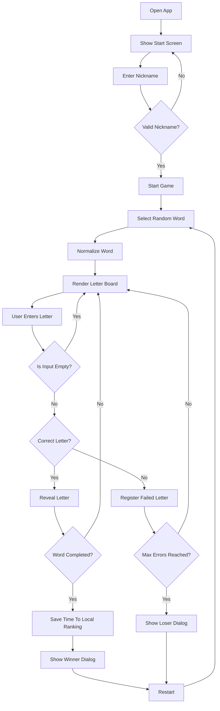

# Game Flow

```mermaid
flowchart TD
  A[Open App] --> B[Show Start Screen]
  B --> C[Enter Nickname]
  C --> D{Valid Nickname?}
  D -->|No| B
  D -->|Yes| E[Start Game]
  E --> F[Select Random Word]
  F --> G[Normalize Word]
  G --> H[Render Letter Board]
  H --> I[User Enters Letter]
  I --> J{Is Input Empty?}
  J -->|Yes| H
  J -->|No| K{Correct Letter?}
  K -->|Yes| L[Reveal Letter]
  K -->|No| M[Register Failed Letter]
  L --> N{Word Completed?}
  M --> O{Max Errors Reached?}
  N -->|Yes| P[Save Time To Local Ranking]
  N -->|No| H
  O -->|Yes| Q[Show Loser Dialog]
  O -->|No| H
  P --> R[Show Winner Dialog]
  R --> S[Restart]
  Q --> S
  S --> F
```
